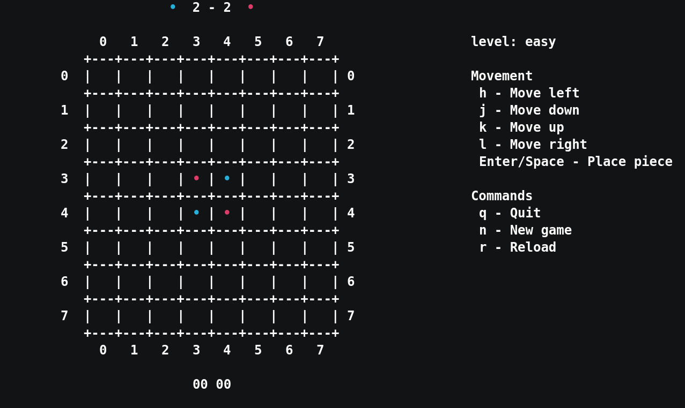

## Gothello

A terminal Othello game written in Go, includes a Monte Carlo Tree Search-based
player.  The implementation of the player follows from the int8's [repo](https://github.com/int8/gomcts)

## Install
```sh
$ go get github.com/unathi-skosana/gothello
```

## Showcase



